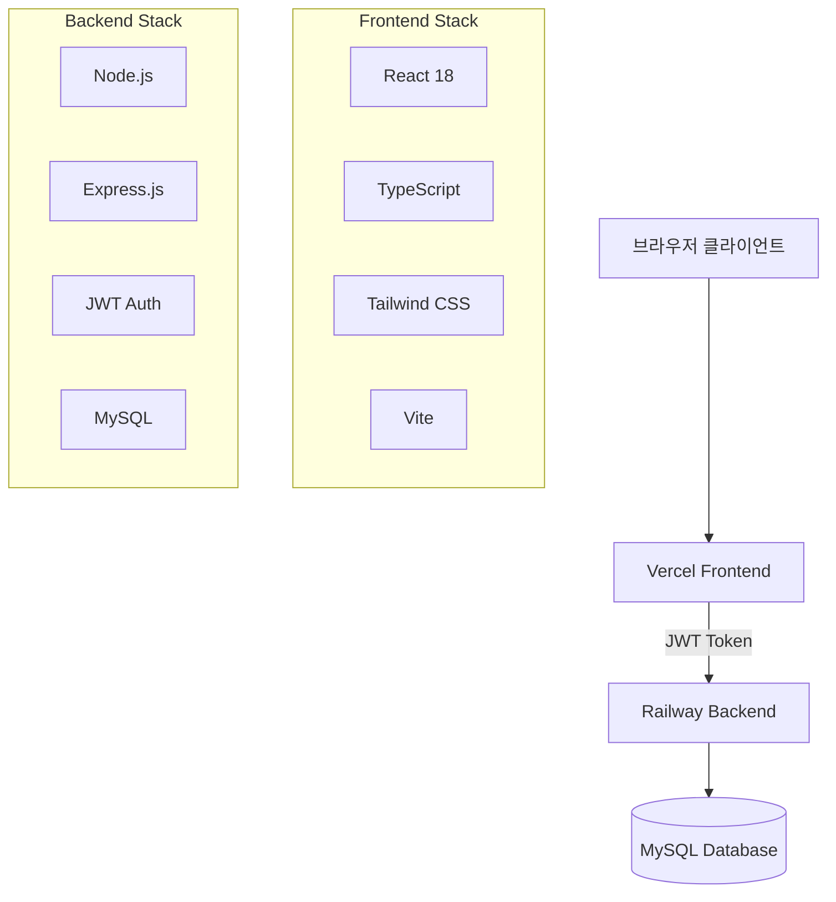

# 🚚 ikea_fds WebApp (Shipping Management System)

한국 물류 업체를 위한 현대적인 배송 접수 및 관리 시스템입니다.

## 🌐 배포된 애플리케이션

| 구분 | URL | 상태 | 플랫폼 |
|------|-----|------|--------|
| **프론트엔드** | https://fdapp-rokx.vercel.app | ✅ 운영 중 | Vercel |
| **백엔드 API** | https://fdapp-production.up.railway.app | ✅ 운영 중 | Railway |

### 💳 테스트 계정
- **관리자**: `admin` / `admin123`
- **일반 사용자**: 회원가입 후 이용

## 📋 프로젝트 개요

### 🎯 목적
중소 물류 업체의 배송 접수 업무를 디지털화하고 효율성을 높이기 위한 웹 기반 관리 시스템

### ✨ 주요 기능
- **🔐 사용자 인증**: JWT 토큰 기반 보안 로그인
- **📦 배송 접수**: 직관적인 UI로 간편한 배송 정보 입력
- **📱 반응형 디자인**: 모바일, 태블릿, 데스크톱 완벽 지원
- **📊 관리자 대시보드**: 실시간 배송 현황 및 통계
- **🚚 배송 추적**: 운송장 번호로 실시간 배송 상태 확인
- **📋 사용자 관리**: 권한별 접근 제어 및 사용자 관리
- **📈 데이터 내보내기**: Excel/CSV 형태로 배송 데이터 다운로드

## 🏗️ 시스템 아키텍처



## 🔧 기술 스택

### Frontend
- **Framework**: React 18 + TypeScript
- **Build Tool**: Vite
- **Styling**: Tailwind CSS
- **State Management**: Context API + React Hooks
- **HTTP Client**: Axios
- **Authentication**: JWT + localStorage
- **Deployment**: Vercel

### Backend
- **Runtime**: Node.js
- **Framework**: Express.js
- **Database**: MySQL
- **Authentication**: JWT + Session (Hybrid)
- **Security**: bcryptjs, CORS, Rate Limiting
- **Deployment**: Railway

## 🚀 빠른 시작

### 전체 프로젝트 클론
```bash
git clone https://github.com/termpro2000/fdapp.git backend
git clone https://github.com/termpro2000/fdapp-frontend.git frontend
cd ikea_fds
```

### 백엔드 설정 및 실행
```bash
cd backend
npm install
cp .env.example .env  # 환경변수 설정
npm run setup-db      # 데이터베이스 초기화
npm run dev           # 개발 서버 실행 (포트 3000)
```

### 프론트엔드 설정 및 실행
```bash
cd frontend
npm install
cp .env.example .env  # 환경변수 설정
npm run dev           # 개발 서버 실행 (포트 5173)
```

## 🔐 인증 시스템

### JWT + Session 하이브리드 인증
본 프로젝트는 크로스도메인 환경(Vercel ↔ Railway)에서 안정적인 인증을 위해 **JWT 토큰과 세션을 동시에 사용하는 하이브리드 방식**을 채택했습니다.

#### 인증 플로우
1. **로그인**: 서버에서 JWT 토큰과 세션 쿠키 동시 생성
2. **토큰 저장**: 클라이언트에서 JWT를 localStorage에 저장
3. **API 요청**: JWT 토큰을 Authorization 헤더로 전송
4. **인증 검증**: JWT 우선 검증, 실패 시 세션으로 fallback
5. **자동 관리**: 토큰 만료 시 자동 로그아웃 및 정리

#### 보안 특징
- **24시간 토큰 만료**: 자동 보안 갱신
- **XSS/CSRF 방지**: 토큰 기반 상태 비저장 인증
- **Rate Limiting**: IP당 15분에 100회 요청 제한
- **Password Hashing**: bcryptjs 기반 안전한 비밀번호 저장

## 📱 사용자 인터페이스

### 반응형 디자인
- **Mobile First**: 모바일 우선 설계
- **Progressive Enhancement**: 화면 크기별 기능 확장
- **Touch Friendly**: 터치 디바이스 최적화

### 주요 화면
- **로그인/회원가입**: 직관적인 인증 페이지
- **배송 접수**: 단계별 배송 정보 입력 폼
- **대시보드**: 개인/관리자별 맞춤 대시보드
- **배송 추적**: 실시간 배송 상태 확인
- **사용자 관리**: 권한 기반 사용자 관리 (관리자)

## 📊 데이터베이스 설계

### 주요 테이블
- **users**: 사용자 정보 및 권한 관리
- **shipping_orders**: 배송 접수 정보
- **user_activities**: 사용자 활동 로그
- **order_status_history**: 배송 상태 변경 이력

## 🚀 배포 및 운영

### 프로덕션 환경
- **Frontend**: Vercel을 통한 CDN 기반 정적 호스팅
- **Backend**: Railway를 통한 Node.js 애플리케이션 호스팅
- **Database**: Railway MySQL 관리형 데이터베이스

### CI/CD 파이프라인
- **GitHub**: 소스코드 버전 관리
- **자동 배포**: Git push 시 자동 빌드 및 배포
- **Zero Downtime**: 롤링 업데이트 방식 배포

### 모니터링
- **Health Check**: `/health` 엔드포인트 기반 서버 상태 확인
- **Error Logging**: 상세한 에러 추적 및 로그 기록
- **Performance**: Vercel Analytics 기반 성능 모니터링

## 📈 개발 진행 과정

### Phase 1: 기반 시스템 구축 (완료)
- ✅ React + TypeScript + Node.js 기본 셋업
- ✅ 데이터베이스 설계 및 구현
- ✅ 기본 CRUD 기능 구현
- ✅ 사용자 인증 시스템 구현

### Phase 2: 고급 기능 및 UI/UX (완료)
- ✅ 반응형 웹 디자인 구현
- ✅ 관리자 대시보드 개발
- ✅ 배송 추적 시스템 구현
- ✅ 데이터 내보내기 기능

### Phase 3: 배포 및 운영 (완료)
- ✅ Vercel 프론트엔드 배포
- ✅ Railway 백엔드 배포
- ✅ 크로스도메인 인증 문제 해결
- ✅ JWT 토큰 기반 인증 시스템 완성
- ✅ 프로덕션 환경 최적화

## 🛡️ 보안 및 성능

### 보안 기능
- **입력 검증**: 모든 사용자 입력에 대한 서버/클라이언트 이중 검증
- **SQL Injection 방지**: Prepared Statement 사용
- **Rate Limiting**: DDoS 공격 방지
- **HTTPS 강제**: 모든 통신 암호화

### 성능 최적화
- **Code Splitting**: 라우트별 청크 분할로 초기 로딩 속도 향상
- **Image Optimization**: WebP 형태 자동 변환
- **CDN**: Vercel Edge Network 활용
- **Database Indexing**: 쿼리 성능 최적화

## 🤝 기여 가이드

### 개발 환경 설정
1. Node.js 18+ 설치
2. MySQL 8.0+ 설치 및 설정
3. 프로젝트 클론 및 의존성 설치
4. 환경변수 설정 (.env 파일)
5. 데이터베이스 초기화

### 코딩 컨벤션
- **TypeScript**: 엄격한 타입 검사
- **ESLint + Prettier**: 코드 품질 및 포맷 통일
- **Conventional Commits**: 커밋 메시지 규칙 준수
- **Component-First**: 재사용 가능한 컴포넌트 우선 설계

## 📞 지원 및 문의

- **이슈 리포트**: GitHub Issues를 통한 버그 리포트 및 기능 요청
- **기술 문의**: 프로젝트 관련 기술적 질문 환영

## 📄 라이센스

이 프로젝트는 [MIT License](LICENSE)를 따릅니다.

---

## 🏆 프로젝트 성과

### 기술적 달성
- ✅ **크로스도메인 인증 해결**: Vercel과 Railway 간 JWT 기반 인증 구현
- ✅ **모던 스택 활용**: React 18, TypeScript, Vite 등 최신 기술 스택
- ✅ **반응형 디자인**: 모든 디바이스에서 완벽한 사용자 경험
- ✅ **보안 강화**: JWT + 세션 하이브리드 인증으로 보안성 향상
- ✅ **성능 최적화**: 코드 분할 및 CDN 활용으로 빠른 로딩 속도

### 비즈니스 가치
- 📈 **업무 효율성**: 수기 작업 → 디지털 자동화
- 📱 **접근성**: 언제 어디서나 모바일로 배송 접수 가능
- 📊 **데이터 기반**: 실시간 통계 및 분석 기능
- 🔒 **보안성**: 기업급 보안 기준 준수
- 💰 **비용 효율**: 오픈소스 기반 저비용 구축

---

**🤖 Generated with Claude Code** - 현대적이고 안전한 웹 애플리케이션을 목표로 합니다.

**개발 기간**: 2024.08.26 - 2024.08.28 (3일)  
**현재 상태**: 🟢 프로덕션 운영 중