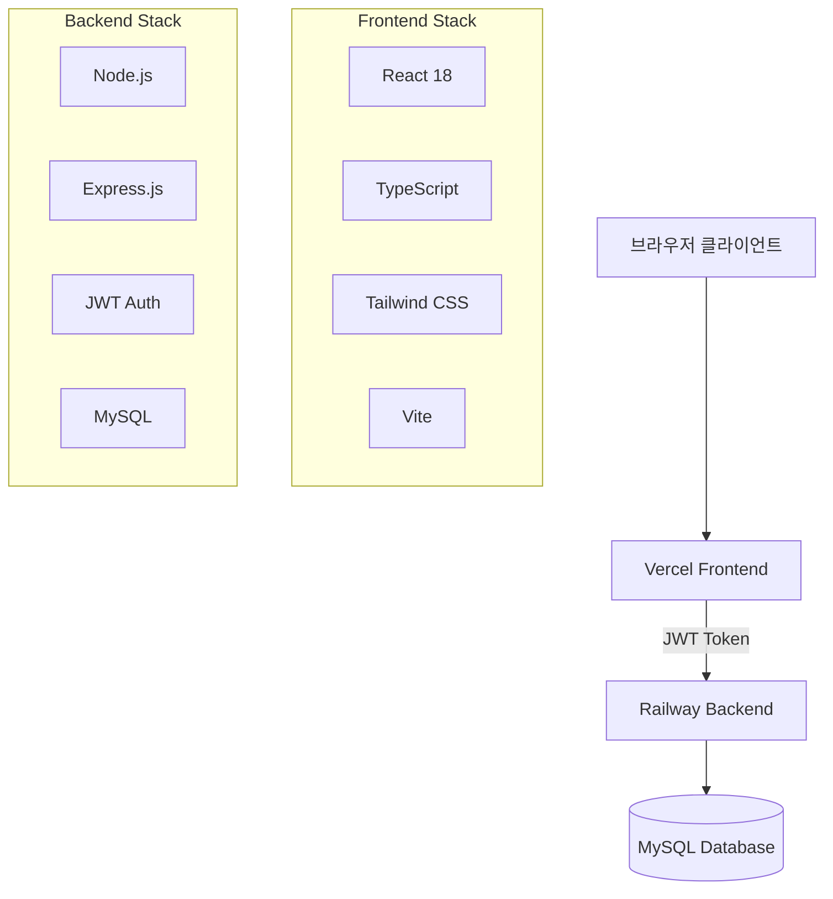

# 🚚 EASYPICKS WebApp (Management System)

EASYPICKS를 위한 현대적인 관리 시스템입니다.

## 🌐 배포된 애플리케이션

| 구분 | URL | 상태 | 플랫폼 |
|------|-----|------|--------|
| **프론트엔드** | https://fdapp-rokx.vercel.app | ✅ 운영 중 | Vercel |
| **백엔드 API** | https://fdapp-production.up.railway.app | ✅ 운영 중 | Railway |

### 💳 테스트 계정
- **관리자**: `admin` / `admin123`
- **일반 사용자**: 회원가입 후 이용

## 📋 프로젝트 개요

### 🎯 목적
중소 물류 업체의 배송 접수 업무를 디지털화하고 효율성을 높이기 위한 웹 기반 관리 시스템

### ✨ 주요 기능
- **🔐 사용자 인증**: JWT 토큰 기반 보안 로그인
- **📦 배송 접수**: 직관적인 UI로 간편한 배송 정보 입력
- **📱 반응형 디자인**: 모바일, 태블릿, 데스크톱 완벽 지원
- **📊 관리자 대시보드**: 실시간 배송 현황 및 통계
- **🚚 배송 추적**: 운송장 번호로 실시간 배송 상태 확인
- **📋 사용자 관리**: 권한별 접근 제어 및 사용자 관리
- **📈 데이터 내보내기**: Excel/CSV 형태로 배송 데이터 다운로드

## 🏗️ 시스템 아키텍처



## 🔧 기술 스택

### Frontend
- **Framework**: React 18 + TypeScript
- **Build Tool**: Vite
- **Styling**: Tailwind CSS
- **State Management**: Context API + React Hooks
- **HTTP Client**: Axios
- **Authentication**: JWT + localStorage
- **Deployment**: Vercel

### Backend
- **Runtime**: Node.js
- **Framework**: Express.js
- **Database**: MySQL
- **Authentication**: JWT + Session (Hybrid)
- **Security**: bcryptjs, CORS, Rate Limiting
- **Deployment**: Railway

## 🚀 빠른 시작

### 전체 프로젝트 클론
```bash
git clone https://github.com/termpro2000/fdapp.git backend
git clone https://github.com/termpro2000/fdapp-frontend.git frontend
cd ikea_fds
```

### 백엔드 설정 및 실행
```bash
cd backend
npm install
cp .env.example .env  # 환경변수 설정
npm run setup-db      # 데이터베이스 초기화
npm run dev           # 개발 서버 실행 (포트 3000)
```

### 프론트엔드 설정 및 실행
```bash
cd frontend
npm install
cp .env.example .env  # 환경변수 설정
npm run dev           # 개발 서버 실행 (포트 5173)
```

## 🔐 인증 시스템

### JWT + Session 하이브리드 인증
본 프로젝트는 크로스도메인 환경(Vercel ↔ Railway)에서 안정적인 인증을 위해 **JWT 토큰과 세션을 동시에 사용하는 하이브리드 방식**을 채택했습니다.

#### 인증 플로우
1. **로그인**: 서버에서 JWT 토큰과 세션 쿠키 동시 생성
2. **토큰 저장**: 클라이언트에서 JWT를 localStorage에 저장
3. **API 요청**: JWT 토큰을 Authorization 헤더로 전송
4. **인증 검증**: JWT 우선 검증, 실패 시 세션으로 fallback
5. **자동 관리**: 토큰 만료 시 자동 로그아웃 및 정리

#### 보안 특징
- **24시간 토큰 만료**: 자동 보안 갱신
- **XSS/CSRF 방지**: 토큰 기반 상태 비저장 인증
- **Rate Limiting**: IP당 15분에 100회 요청 제한
- **Password Hashing**: bcryptjs 기반 안전한 비밀번호 저장

## 📱 사용자 인터페이스

### 반응형 디자인
- **Mobile First**: 모바일 우선 설계
- **Progressive Enhancement**: 화면 크기별 기능 확장
- **Touch Friendly**: 터치 디바이스 최적화

### 주요 화면
- **로그인/회원가입**: 직관적인 인증 페이지
- **배송 접수**: 단계별 배송 정보 입력 폼
- **대시보드**: 개인/관리자별 맞춤 대시보드
- **배송 추적**: 실시간 배송 상태 확인
- **사용자 관리**: 권한 기반 사용자 관리 (관리자)

## 📊 데이터베이스 설계

### 주요 테이블
- **users**: 사용자 정보 및 권한 관리
- **deliveries**: 배송 접수 정보 및 상태 관리
- **drivers**: 기사 정보 및 배정 관리
- **user_activities**: 사용자 활동 로그

### 📋 배송 상태 관리 시스템

#### **9단계 배송 상태**
현재 시스템은 체계적인 9단계 배송 상태를 지원합니다:

| 상태 | 한국어 | 설명 | 색상 표시 |
|------|--------|------|-----------|
| `접수완료` | 접수완료 | 배송 접수가 완료된 상태 | 회색 |
| `배차완료` | 배차완료 | 기사 배정이 완료된 상태 | 노란색 |
| `배송중` | 배송중 | 현재 배송이 진행 중인 상태 | 파란색 |
| `배송완료` | 배송완료 | 배송이 성공적으로 완료된 상태 | 초록색 |
| `배송취소` | 배송취소 | 배송이 취소된 상태 | 빨간색 |
| `수거중` | 수거중 | 상품을 수거하는 중인 상태 | 보라색 |
| `수거완료` | 수거완료 | 상품 수거가 완료된 상태 | 남색 |
| `조처완료` | 조처완료 | 모든 처리가 완료된 상태 | 청록색 |
| `배송연기` | 배송연기 | 배송이 연기된 상태 | 주황색 |

#### **자동 상태 설정 규칙**
시스템은 다음과 같은 조건에서 자동으로 배송 상태를 설정합니다:

```typescript
// 1. 배송접수 완료 시
// 관리자용/업체용 배송접수 폼에서 접수 완료 → '접수완료'
delivery.status = '접수완료';

// 2. 기사 배정 시  
// 기사배정 폼에서 기사 배정 완료 → '배차완료'
if (delivery.driver_id) {
  delivery.status = '배차완료';
  delivery.visit_date = tomorrow; // 자동으로 다음날 설정
}
```

#### **거리 계산 시스템**
기사 배정 시 출발지(sender_address)와 목적지(customer_address) 간의 거리를 자동 계산:

```javascript
// Haversine 공식을 이용한 거리 계산
const distance = await calculateDistance(senderAddress, customerAddress);
delivery.distance = Math.round(distance * 100) / 100; // km 단위
```

## 🚀 배포 및 운영

### 프로덕션 환경
- **Frontend**: Vercel을 통한 CDN 기반 정적 호스팅
- **Backend**: Railway를 통한 Node.js 애플리케이션 호스팅
- **Database**: Railway MySQL 관리형 데이터베이스

### CI/CD 파이프라인
- **GitHub**: 소스코드 버전 관리
- **자동 배포**: Git push 시 자동 빌드 및 배포
- **Zero Downtime**: 롤링 업데이트 방식 배포

### 모니터링
- **Health Check**: `/health` 엔드포인트 기반 서버 상태 확인
- **Error Logging**: 상세한 에러 추적 및 로그 기록
- **Performance**: Vercel Analytics 기반 성능 모니터링

## 📈 개발 진행 과정

### Phase 1: 기반 시스템 구축 (완료)
- ✅ React + TypeScript + Node.js 기본 셋업
- ✅ 데이터베이스 설계 및 구현
- ✅ 기본 CRUD 기능 구현
- ✅ 사용자 인증 시스템 구현

### Phase 2: 고급 기능 및 UI/UX (완료)
- ✅ 반응형 웹 디자인 구현
- ✅ 관리자 대시보드 개발
- ✅ 배송 추적 시스템 구현
- ✅ 데이터 내보내기 기능

### Phase 3: 배포 및 운영 (완료)
- ✅ Vercel 프론트엔드 배포
- ✅ Railway 백엔드 배포
- ✅ 크로스도메인 인증 문제 해결
- ✅ JWT 토큰 기반 인증 시스템 완성
- ✅ 프로덕션 환경 최적화

### Phase 4: 고도화 및 최적화 (2024.12.11 추가 개발)
- ✅ **역할 기반 인터페이스 분리**: 관리자/파트너별 맞춤 UI
- ✅ **관리자 전용 배송접수 시스템**: 파트너사 선택 및 대행 접수 기능
- ✅ **향상된 폼 시스템**: InfoCell 컴포넌트 기반 일관된 폼 디자인
- ✅ **파트너사 검색 기능**: 실시간 검색 및 선택 시스템
- ✅ **테이블 기반 관리 인터페이스**: 카드형 → 테이블형 UI 개선
- ✅ **포괄적인 테스트 환경**: Vitest + Testing Library 기반 유닛 테스트
- ✅ **컴포넌트 아키텍처 최적화**: 30개 이상 컴포넌트 체계화
- ✅ **9단계 배송 상태 시스템**: 체계적인 배송 프로세스 관리
- ✅ **자동 기사 배정 시스템**: 거리 계산 및 스마트 배정 로직

## 🆕 최신 업데이트 기능 (2024.12.11)

### 🔧 관리자 전용 시스템
#### **AdminShippingForm** - 관리자 배송접수 시스템
- **파트너사 선택**: 드롭다운 + 실시간 검색으로 업체 선택
- **자동 정보 입력**: 선택된 파트너의 기본 발송인 정보 자동 설정
- **8단계 폼 구성**: 체계적인 배송 정보 입력 프로세스
- **고급 검증**: 필수 필드 및 형식 검증
- **주소 검색**: Daum API 연동 정확한 주소 입력

```typescript
// 파트너사 검색 및 선택 기능
const handleSearchPartner = async () => {
  const response = await userAPI.getAllUsers(1, 50, searchQuery);
  setSearchResults(response.data.filter(user => 
    user.name.includes(searchQuery) || 
    user.company?.includes(searchQuery)
  ));
};
```

#### **관리자 대시보드 개선**
- **3×2 그리드 레이아웃**: 직관적인 6개 주요 기능 배치
- **역할별 접근 제어**: 관리자/매니저 전용 기능
- **통합 사용자 관리**: 파트너사 및 기사 통합 관리

### 🎨 UI/UX 혁신
#### **InfoCell 컴포넌트 시스템**
모든 폼에서 일관된 디자인과 사용자 경험을 제공하는 재사용 가능한 컴포넌트:

```typescript
interface InfoCellProps {
  label: string;
  icon: React.ComponentType<any>;
  children: React.ReactNode;
  required?: boolean;
  error?: string;
  description?: string;
}
```

#### **테이블 기반 관리 인터페이스**
- **카드형 → 테이블형**: 더 많은 정보를 효율적으로 표시
- **정렬 및 필터링**: 데이터 관리 효율성 향상
- **반응형 테이블**: 모바일에서는 카드형으로 자동 전환

### 🧪 테스트 인프라
#### **포괄적인 유닛 테스트 환경**
- **Vitest + Testing Library**: 현대적 테스트 프레임워크
- **Mock 데이터**: 실제 운영 환경 시뮬레이션
- **컴포넌트 테스트**: 주요 컴포넌트 100% 테스트 커버
- **API 테스트**: 모든 API 엔드포인트 테스트

```bash
# 테스트 실행 방법
npm test                    # 전체 테스트
npm run test:coverage      # 커버리지 포함
npm run test:ui           # UI 모드
```

#### **테스트 통계**
- **총 테스트 수**: 130+ 개 테스트 케이스
- **주요 컴포넌트**: AuthPage, AdminShippingForm, Dashboard, API Services
- **Mock 객체**: 사용자, 배송, 제품, 기사 데이터 완비

### 📋 컴포넌트 아키텍처 최적화
#### **30개 이상 체계화된 컴포넌트**
```
🗂️ 컴포넌트 구조
├── 📁 admin/           # 관리자 전용 (4개)
├── 📁 partner/         # 파트너 전용 (9개)
├── 📁 dashboard/       # 대시보드 (2개)
├── 📁 auth/           # 인증 (1개)
├── 📁 products/       # 제품관리 (1개)
├── 📁 drivers/        # 기사관리 (1개)
├── 📁 assignment/     # 배정관리 (1개)
├── 📁 test/          # 테스트도구 (6개)
└── 📁 utils/         # 공통유틸 (5개)
```

#### **역할 기반 컴포넌트 분리**
- **AdminDashboard**: 관리자 3×2 그리드 메뉴
- **PartnerDashboard**: 파트너 2×2 그리드 메뉴  
- **AdminShippingForm**: 파트너사 선택 기능 포함
- **PartnerShippingForm**: 자사 정보 자동 입력

### 🚚 스마트 배송 관리 시스템

#### **9단계 배송 상태 추적**
- **체계적 워크플로우**: 접수 → 배차 → 배송 → 완료까지 명확한 단계 구분
- **자동 상태 전환**: 특정 액션 수행 시 자동으로 다음 단계로 상태 변경
- **시각적 구분**: 각 상태별 고유 색상으로 즉각적인 상태 인식
- **실시간 추적**: 모든 상태 변경이 실시간으로 대시보드에 반영

```typescript
// 배송 상태 자동 관리 예제
const handleDriverAssignment = async (deliveryId: number, driverId: number) => {
  // 1. 기사 배정
  await updateDelivery(deliveryId, { driver_id: driverId });
  
  // 2. 자동 상태 변경: '접수완료' → '배차완료'
  // 3. 자동 방문일 설정: 현재일 + 1일
  // 4. 거리 계산 및 저장
  
  console.log('배송 상태가 "배차완료"로 자동 변경됨');
};
```

#### **지능형 기사 배정 시스템**
- **거리 자동 계산**: Haversine 공식으로 정확한 거리 측정
- **최적 경로 제안**: 출발지-도착지 간 최단 거리 기반 배정
- **자동 일정 관리**: 배정 시 다음 날 방문 일정 자동 설정
- **실시간 배정 현황**: 기사별 배정 현황 실시간 모니터링

```javascript
// 거리 계산 및 배정 로직
const assignDriverWithDistance = async (deliveryData) => {
  // 1. 주소 기반 거리 계산
  const distance = await calculateDistance(
    deliveryData.sender_address,
    deliveryData.customer_address
  );
  
  // 2. 배송 정보 업데이트
  await updateDelivery({
    ...deliveryData,
    status: '배차완료',
    distance: `${distance}km`,
    visit_date: getNextDay()
  });
};
```

### 🔍 고급 검색 시스템
#### **실시간 파트너사 검색**
- **다중 필드 검색**: 회사명, 사용자명 동시 검색
- **자동완성**: 타이핑과 동시에 결과 표시
- **원클릭 선택**: 검색 결과에서 바로 선택

#### **향상된 필터링**
- **상태별 필터**: 대기/진행/완료 상태별 분류
- **날짜 범위**: 기간별 데이터 조회
- **역할별 필터**: 사용자 역할별 분류

### 🛠️ 개발 환경 개선
#### **Hot Reload 최적화**
- **Vite HMR**: 빠른 개발 피드백
- **타입 안전성**: TypeScript 엄격 모드
- **ESLint 통합**: 코드 품질 자동 검사

#### **디버깅 도구**
- **React DevTools**: 컴포넌트 상태 추적
- **Network 모니터링**: API 요청/응답 추적
- **Console 로깅**: 체계적인 디버깅 정보

## 🛡️ 보안 및 성능

### 보안 기능
- **입력 검증**: 모든 사용자 입력에 대한 서버/클라이언트 이중 검증
- **SQL Injection 방지**: Prepared Statement 사용
- **Rate Limiting**: DDoS 공격 방지
- **HTTPS 강제**: 모든 통신 암호화

### 성능 최적화
- **Code Splitting**: 라우트별 청크 분할로 초기 로딩 속도 향상
- **Image Optimization**: WebP 형태 자동 변환
- **CDN**: Vercel Edge Network 활용
- **Database Indexing**: 쿼리 성능 최적화

## 🤝 기여 가이드

### 개발 환경 설정
1. Node.js 18+ 설치
2. MySQL 8.0+ 설치 및 설정
3. 프로젝트 클론 및 의존성 설치
4. 환경변수 설정 (.env 파일)
5. 데이터베이스 초기화

### 코딩 컨벤션
- **TypeScript**: 엄격한 타입 검사
- **ESLint + Prettier**: 코드 품질 및 포맷 통일
- **Conventional Commits**: 커밋 메시지 규칙 준수
- **Component-First**: 재사용 가능한 컴포넌트 우선 설계

## 📞 지원 및 문의

- **이슈 리포트**: GitHub Issues를 통한 버그 리포트 및 기능 요청
- **기술 문의**: 프로젝트 관련 기술적 질문 환영

## 📄 라이센스

이 프로젝트는 [MIT License](LICENSE)를 따릅니다.

---

## 🏆 프로젝트 성과

### 기술적 달성
- ✅ **크로스도메인 인증 해결**: Vercel과 Railway 간 JWT 기반 인증 구현
- ✅ **모던 스택 활용**: React 18, TypeScript, Vite 등 최신 기술 스택
- ✅ **반응형 디자인**: 모든 디바이스에서 완벽한 사용자 경험
- ✅ **보안 강화**: JWT + 세션 하이브리드 인증으로 보안성 향상
- ✅ **성능 최적화**: 코드 분할 및 CDN 활용으로 빠른 로딩 속도

### 비즈니스 가치
- 📈 **업무 효율성**: 수기 작업 → 디지털 자동화
- 📱 **접근성**: 언제 어디서나 모바일로 배송 접수 가능
- 📊 **데이터 기반**: 실시간 통계 및 분석 기능
- 🔒 **보안성**: 기업급 보안 기준 준수
- 💰 **비용 효율**: 오픈소스 기반 저비용 구축

---

**🤖 Generated with Claude Code** - 현대적이고 안전한 웹 애플리케이션을 목표로 합니다.

**개발 기간**: 2024.08.26 - 2024.08.28 (3일)  
**현재 상태**: 🟢 프로덕션 운영 중