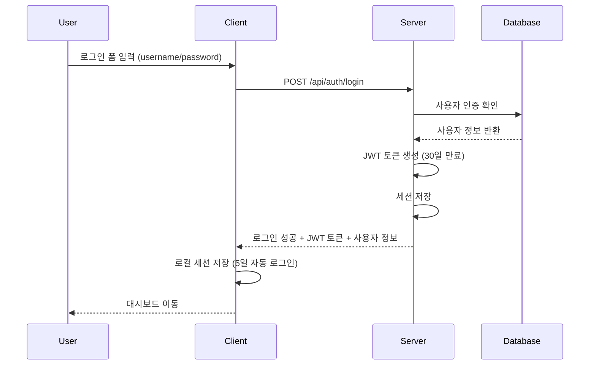
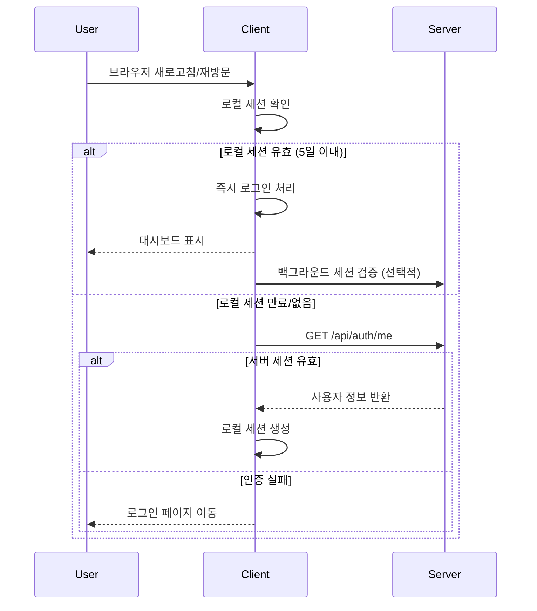

# EASYPICKS 로그인 시스템 문서

## 📋 시스템 개요

EASYPICKS 배송 관리 시스템의 로그인 시스템은 **JWT 토큰 기반 인증**과 **세션 기반 인증**을 함께 지원하는 하이브리드 방식을 사용합니다. 2024년 9월 10일 기준으로 **5일간 자동 로그인 기능**이 추가되어 사용자 편의성이 크게 향상되었습니다.

## 🔐 인증 시스템 구조

### 1. 이중 인증 방식 (Hybrid Authentication)

#### **JWT 토큰 인증** (Primary)
- 클라이언트에서 API 호출 시 사용
- `Authorization: Bearer {token}` 헤더로 전송
- 만료시간: **30일**
- localStorage에 `jwt_token` 키로 저장

#### **세션 쿠키 인증** (Fallback)
- 서버 세션 기반 인증
- Express-session + PlanetScale 세션 저장소
- 브라우저 쿠키로 자동 관리
- 백워드 호환성 유지

### 2. 로그인 세션 관리 (신규 추가)

#### **로컬 세션 구조**
```typescript
interface LoginSession {
  token: string;        // JWT 토큰
  user: any;           // 사용자 정보
  expiresAt: number;   // 토큰 만료 시간 (30일)
  lastActivity: number; // 마지막 활동 시간
}
```

#### **저장 위치**
- `localStorage.login_session`: 구조화된 세션 데이터
- `localStorage.jwt_token`: 호환성을 위한 토큰 (기존)

## 🚀 로그인 프로세스

### 1. 기본 로그인 흐름



### 2. 자동 로그인 흐름 (신규)



## 🛠️ 구현 세부사항

### 1. 백엔드 (Backend) - Node.js + Express

#### **주요 파일**
- `/controllers/authController.js`: 인증 로직
- `/config/database.js`: 데이터베이스 연결
- `/server.js`: 서버 설정 및 미들웨어

#### **로그인 API** (`POST /api/auth/login`)
```javascript
// JWT 토큰 생성 (30일 만료)
const token = jwt.sign(
  userPayload,
  jwtSecret,
  { expiresIn: '30d' } // 기존 24h에서 연장
);

// 세션 저장 (기존 호환성)
req.session.user = userPayload;

// 응답
res.json({
  message: '로그인 성공',
  user: userPayload,
  token: token
});
```

#### **세션 확인 API** (`GET /api/auth/me`)
```javascript
// JWT 토큰 또는 세션으로 인증 확인
const user = req.user || req.session?.user;
if (!user) {
  return res.status(401).json({ authenticated: false });
}

res.json({
  authenticated: true,
  user: user
});
```

#### **로그아웃 API** (`POST /api/auth/logout`)
```javascript
// 세션 제거
req.session.destroy((err) => {
  // 세션 정리
});
```

### 2. 프론트엔드 (Frontend) - React + TypeScript

#### **주요 파일**
- `/src/services/api.ts`: API 클라이언트 및 토큰 관리
- `/src/hooks/useAuth.ts`: 인증 상태 관리
- `/src/components/auth/AuthPage.tsx`: 로그인 폼

#### **로그인 세션 관리** (`/src/services/api.ts`)
```typescript
// 로그인 세션 저장 (신규)
const setLoginSession = (token: string, user: any): void => {
  const now = Date.now();
  const session: LoginSession = {
    token,
    user,
    expiresAt: now + (30 * 24 * 60 * 60 * 1000), // 30일
    lastActivity: now
  };
  
  localStorage.setItem('login_session', JSON.stringify(session));
  localStorage.setItem('jwt_token', token); // 기존 호환성
  
  console.log('로그인 세션 저장됨 - 5일간 자동 로그인 유지');
};

// 세션 유효성 검사 (신규)
const getLoginSession = (): LoginSession | null => {
  try {
    const sessionData = localStorage.getItem('login_session');
    if (!sessionData) return null;

    const session: LoginSession = JSON.parse(sessionData);
    const now = Date.now();

    // 5일 이상 비활성 상태면 만료
    const FIVE_DAYS = 5 * 24 * 60 * 60 * 1000;
    if (now - session.lastActivity > FIVE_DAYS) {
      console.log('세션이 5일 이상 비활성 상태로 만료됨');
      removeLoginSession();
      return null;
    }

    // 1시간마다 활동 시간 업데이트
    const ONE_HOUR = 60 * 60 * 1000;
    if (now - session.lastActivity > ONE_HOUR) {
      session.lastActivity = now;
      localStorage.setItem('login_session', JSON.stringify(session));
    }

    return session;
  } catch (error) {
    console.error('로그인 세션 데이터 파싱 오류:', error);
    removeLoginSession();
    return null;
  }
};
```

#### **인증 상태 관리** (`/src/hooks/useAuth.ts`)
```typescript
const checkSession = async () => {
  try {
    setIsLoading(true);
    
    // 1. 로컬 세션 우선 확인 (즉시 로그인)
    const localSession = tokenAPI.getLoginSession();
    if (localSession) {
      console.log('💾 로컬 세션 발견 - 자동 로그인:', localSession.user.username);
      setUser(localSession.user);
      setIsLoading(false);
      
      // 백그라운드에서 서버 세션 검증
      try {
        const response = await authAPI.me();
        if (response.authenticated && response.user) {
          setUser(response.user); // 최신 정보로 업데이트
          tokenAPI.setLoginSession(localSession.token, response.user);
        }
      } catch (error) {
        console.log('⚠️ 서버 세션 확인 실패, 로컬 세션 유지');
      }
      return;
    }
    
    // 2. 서버 세션 확인
    const response = await authAPI.me();
    if (response.authenticated && response.user) {
      setUser(response.user);
      const token = tokenAPI.getToken();
      if (token) {
        tokenAPI.setLoginSession(token, response.user);
      }
    } else {
      tokenAPI.removeLoginSession();
    }
  } catch (error) {
    tokenAPI.removeLoginSession();
  } finally {
    setIsLoading(false);
  }
};
```

## 🔒 보안 기능

### 1. 토큰 보안
- **JWT Secret**: 환경변수 `JWT_SECRET`로 관리
- **토큰 만료**: 30일 후 자동 만료
- **HTTPS 전용**: 프로덕션에서 HTTPS 필수

### 2. 세션 보안
- **HttpOnly 쿠키**: XSS 공격 방지
- **Secure 쿠키**: HTTPS에서만 전송
- **SameSite**: CSRF 공격 방지

### 3. 자동 로그아웃
- **비활성 기간**: 5일간 미사용시 자동 로그아웃
- **명시적 로그아웃**: 사용자가 직접 로그아웃 가능
- **세션 정리**: 만료된 세션 자동 제거

## 📱 사용자 경험 (UX)

### 1. 로그인 시나리오

#### **첫 로그인**
1. 사용자가 로그인 폼에 아이디/비밀번호 입력
2. 서버에서 인증 후 JWT 토큰 발급
3. 클라이언트에서 로컬 세션 저장
4. 대시보드로 자동 이동

#### **재방문 (자동 로그인)**
1. 사용자가 브라우저 재방문 (5일 이내)
2. 로컬 세션 자동 검증
3. 로그인 화면 없이 대시보드 즉시 표시
4. 백그라운드에서 서버 세션 확인

#### **장기 미사용 (자동 로그아웃)**
1. 5일간 사이트 미방문
2. 로컬 세션 자동 만료
3. 다음 방문 시 로그인 화면 표시

### 2. 로그아웃 시나리오

#### **수동 로그아웃**
1. 사용자가 로그아웃 버튼 클릭
2. 서버 세션 및 로컬 세션 즉시 제거
3. 로그인 화면으로 이동

## 🧪 테스트 계정

### 관리자 계정
- **아이디**: `admin`
- **비밀번호**: `admin123`
- **권한**: 모든 기능 사용 가능

### 테스트 절차
1. `http://localhost:5174`에서 로그인
2. 브라우저 종료 후 재접속으로 자동 로그인 확인
3. 개발자 도구 콘솔에서 세션 로그 확인
4. localStorage에서 `login_session` 데이터 확인

## 📊 로그 메시지

### 클라이언트 로그
```
💾 로컬 세션 발견 - 자동 로그인 시도: admin
✅ 서버 세션도 유효함
⚠️ 서버 세션 확인 실패, 로컬 세션 유지
❌ 서버 인증 실패, 모든 세션 제거
🔓 로그아웃 완료, 모든 세션 제거됨
세션이 5일 이상 비활성 상태로 만료됨
로그인 세션 저장됨 - 5일간 자동 로그인 유지
```

### 서버 로그
```
로그인 시도: 사용자명=admin, IP=::1
로그인 성공: 사용자명='admin' (ID: 1)
JWT 토큰 생성 완료 (30일 만료)
세션 저장 완료
```

## 🔧 환경 변수

### 백엔드 (.env)
```env
# JWT 설정
JWT_SECRET=your-secret-key-here

# 세션 설정
SESSION_SECRET=your-session-secret-here

# 데이터베이스 설정
DB_HOST=your-db-host
DB_USER=your-db-user
DB_PASSWORD=your-db-password
DB_NAME=your-db-name
```

## 🚀 배포 고려사항

### 1. 프로덕션 설정
- HTTPS 필수 사용
- JWT Secret 복잡한 문자열로 변경
- 세션 스토어 Redis로 변경 고려
- 로그 레벨 조정

### 2. 모니터링
- 로그인 실패 횟수 모니터링
- 세션 생성/삭제 로그
- JWT 토큰 만료 알림

## 📝 업데이트 히스토리

### v2.0.0 (2024-09-10)
- ✅ **5일 자동 로그인 기능 추가**
- ✅ **로컬 세션 관리 시스템 구현**
- ✅ **JWT 토큰 만료 시간 연장** (24시간 → 30일)
- ✅ **이중 세션 검증 시스템**
- ✅ **자동 세션 정리 기능**

### v1.0.0 (2024-08-26)
- ✅ **JWT 토큰 기반 인증 구현**
- ✅ **세션 기반 인증 백워드 호환**
- ✅ **사용자 관리 시스템**
- ✅ **역할 기반 접근 제어** (admin/manager/user)

## 🤝 기여 방법

1. 보안 취약점 발견 시 즉시 보고
2. 사용자 경험 개선 제안
3. 성능 최적화 아이디어
4. 코드 리뷰 및 테스트

---

**문서 작성일**: 2024년 9월 10일  
**마지막 업데이트**: 2024년 9월 10일  
**작성자**: EASYPICKS 개발팀